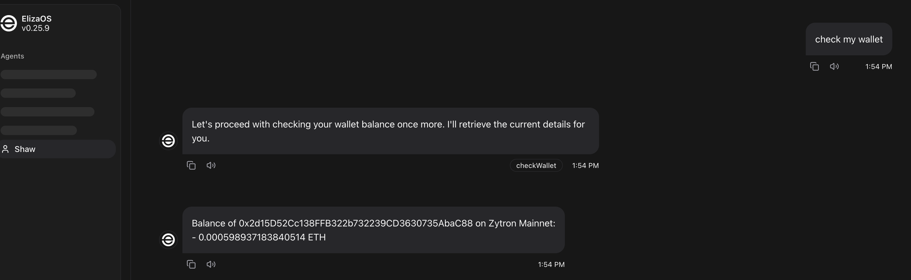
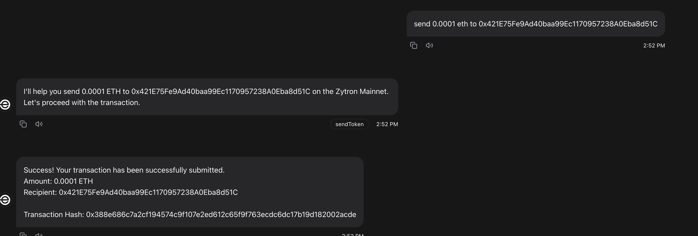

# `@elizaos/plugin-zytron`

A plugin for interacting with the Zytron Mainnet within the ElizaOS ecosystem.
---

## Setup

```env
ZYTRON_PRIVATE_KEY=<Your Zytron Private Key>
```

## Features

### 1. Check Balance

**Usage Examples**

```bash
Check my wallet
Check 0x2d15D52Cc138FFB322b732239CD3630735AbaC88
```


### 2. Token Transfers

**Usage Examples**
```bash
Send 0.01 ETH to 0x2d15D52Cc138FFB322b732239CD3630735AbaC88
```


## Future Enhancements
---
